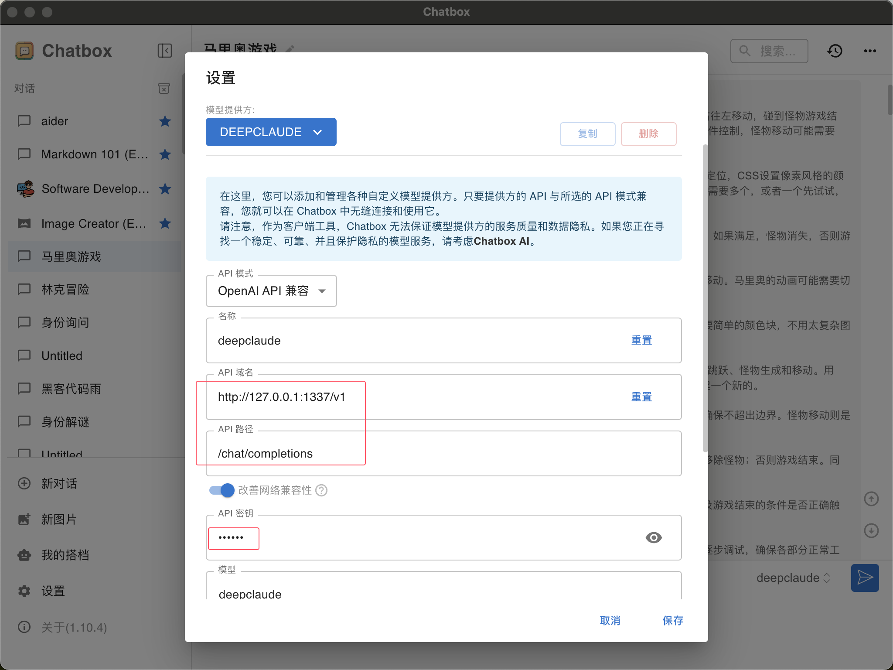
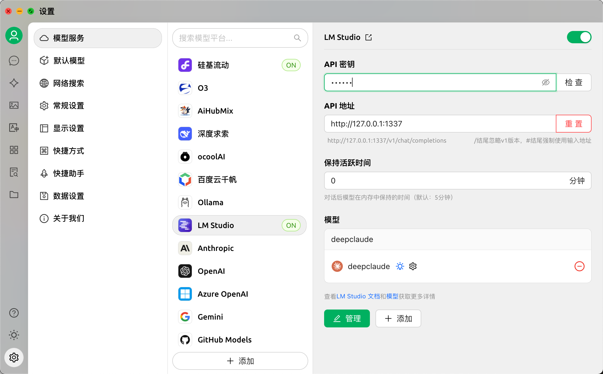

<div align="center">
<h1>DeepClaude_Pro(OpenAI Compatible) 🐬🧠</h1>


<div align="left">
该项目是基于<a href="https://github.com/getAsterisk/deepclaude">deepclaude rust官方</a>版本升级而来，支持了OpenAI格式的返回结果，可以用于chatbox和cherrystudio，同时可以比较自由的替换claude 或者deepseek的第三方api来实现deepclaude或者deepgeminipro等其他模型组合。

借助API，该项目可以结合DeepSeek R1的推理能力以及Claude的创造力和代码生成能力。至于效果，可以看我另一个项目的评测结果<a href="https://github.com/yuanhang110/DeepClaude_Benchmark">deepclaude的benchmark</a>。

后续我将进一步尝试模型多样化组合和提示词工程去优化这个项目，这个项目特点是如果有流程或者工程优化相关的代码修改，会同步的测试benchmark，确保大家可以用上真实有效果提升的api。
</div>

[](https://www.rust-lang.org/)
[](https://deepclaude.asterisk.so)

</div>

<details>
<summary><strong>更新日志：</strong></summary> 
<div>
2025-03-11: 更新 1.0.1版本，修复cherrystudio输出问题
</div>
<div>
2025-03-09: 更新 1.0 版本，支持chatbox和cherrystudio
</div>
</details>

## 概述

DeepClaude是一个高性能的大语言模型（LLM）推理API，它将深度求索R1的思维链（CoT）推理能力与人工智能公司Anthropic的克劳德模型在创造力和代码生成方面的优势相结合。它提供了一个统一的接口，让你在完全掌控自己的API密钥和数据的同时，充分利用这两个模型的优势。

## 功能特性
🚀 **零延迟** - 由高性能的Rust API驱动，先由R1的思维链提供即时响应，随后在单个流中呈现克劳德的回复  
🔒 **私密且安全** - 采用端到端的安全措施，进行本地API密钥管理。你的数据将保持私密  
⚙️ **高度可配置** - 可自定义API和接口的各个方面，以满足你的需求  
🌟 **开源** - 免费的开源代码库。你可以根据自己的意愿进行贡献、修改和部署  
🤖 **双人工智能能力** - 将深度求索R1的推理能力与克劳德的创造力和代码生成能力相结合  
🔑 **自带密钥管理的API** - 在我们的托管基础设施中使用你自己的API密钥，实现完全掌控

## 为什么选择R1和Claude？
深度求索R1的思维链轨迹展示了深度推理能力，达到了大语言模型能够进行“元认知”的程度——能够自我纠正、思考边缘情况，并以自然语言进行准蒙特卡洛树搜索。

然而，R1在代码生成、创造力和对话技巧方面有所欠缺。claude 3.5 sonnet版本在这些领域表现出色，是完美的补充。DeepClaude结合了这两个模型，以提供：
- R1卓越的推理和问题解决能力
- 克劳德出色的代码生成和创造力
- 单次API调用即可实现快速的流式响应
- 使用你自己的API密钥实现完全掌控

## 快速入门
### 先决条件
- Rust 1.75或更高版本
- 深度求索API密钥
- Anthropic API密钥

### 安装步骤
1. 克隆存储库：
   ```bash
   git clone https://github.com/getasterisk/deepclaude.git
   cd deepclaude
   ```
2. 构建项目：
   ```bash
   cargo build --release
   ```

### 配置方法
在项目根目录中编辑一个`.env`文件：
```toml
# api密钥，自己取的
API_KEY=
# deepseek的密钥
DEEPSEEK_API_KEY=
# claude模型的密钥
ANTHROPIC_API_KEY=
# 服务的端口
PORT=1337
```

anthropic.rs文件中再去修改api地址，如果是openai格式的就替换DEEPSEEK_API_URL: &str变量后的“https://ark.cn-beijing.volces.com/api/v3/chat/completions”，如果是ANTHROPIC_API_URL这种v1/messages格式的就一样的替换ANTHROPIC_API_URL: &str =变量后跟的值，然后模型也对应替换就行。

```rust
pub(crate) const ANTHROPIC_API_URL: &str = "https://api.gptsapi.net/v1/messages";
pub(crate) const DEEPSEEK_API_URL: &str = "https://ark.cn-beijing.volces.com/api/v3/chat/completions";
// const DEFAULT_MODEL: &str = "claude-3-5-sonnet-20241022";
//const DEFAULT_MODEL: &str = "wild-3-5-sonnet-20241022";
const DEFAULT_MODEL: &str = "wild-3-7-sonnet-20250219";
```

## API使用方法

请参阅[API文档](https://deepclaude.chat)

### 非流式输出示例

```python
curl -X POST "http://127.0.0.1:1337/v1/chat/completions" \
  -H "Authorization: Bearer xyh110" \
  -H "Content-Type: application/json" \
  -d '{
    "model": "deepclaude",
    "messages": [
        {"role": "user", "content": "你是谁"}
    ]
}'
```

### 流式传输示例
```python
curl -X POST "http://127.0.0.1:1337/v1/chat/completions" \
  -H "Authorization: Bearer xyh110" \
  -H "Content-Type: application/json" \
  -d '{
    "model": "deepclaude",
    "messages": [
        {"role": "user", "content": "你是谁"}
    ],
    "stream": true
}'
```

## 配置选项
API支持通过请求体进行广泛的配置：
```json
{
  "stream": false,
  "verbose": false,
  "system": "可选的系统提示",
  "messages": [...],
  "deepseek_config": {
    "headers": {},
    "body": {}
  },
  "anthropic_config": {
    "headers": {},
    "body": {}
  }
}
```

## 配置chatbox和cherrystudio

密钥都是前面.env中配置的API_KEY=xxx，那么这里就填xxx

**chatbox**



**cherrystudio**



## 自主托管

DeepClaude可以在你自己的基础设施上进行自主托管。请按照以下步骤操作：
1. 配置环境变量或`config.toml`文件
2. 构建Docker镜像或从源代码编译
3. 部署到你首选的托管平台

## 安全性
- 不存储或记录数据
- 采用自带密钥（BYOK）架构
- 定期进行安全审计和更新

# 星星记录

[](https://star-history.com/#ErlichLiu/DeepClaude&Date)

## 贡献代码
我们欢迎贡献！请参阅我们的[贡献指南](CONTRIBUTING.md)，了解有关以下方面的详细信息：
- 行为准则
- 开发流程
- 提交拉取请求
- 报告问题