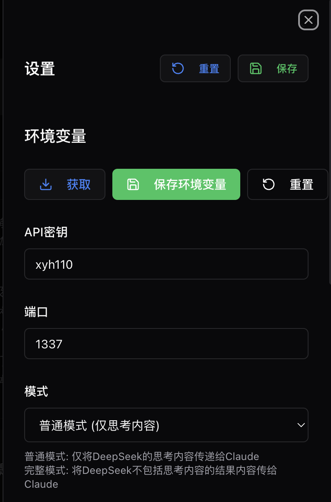
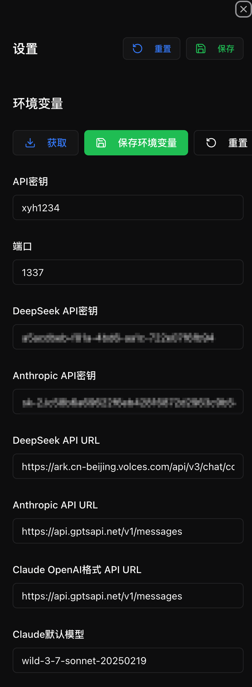

<div align="center">
<h1>DeepClaude_Pro(OpenAI Compatible) 🐬🧠</h1>


<div align="left">
This project is upgraded from the official Rust version of <a href="https://github.com/getAsterisk/deepclaude">deepclaude</a>. It supports the return results in OpenAI format and can be used in chatbox and cherrystudio. At the same time, it allows for relatively free replacement of third-party APIs of Claude or DeepSeek to achieve other model combinations such as deepclaude or deepgeminipro.

With the help of the API, this project can combine the reasoning ability of DeepSeek R1 with the creativity and code generation ability of Claude. As for the effectiveness, you can check the evaluation results of my other project, <a href="https://github.com/yuanhang110/DeepClaude_Benchmark">deepclaude's benchmark</a>.

In the future, I will further explore diverse model combinations and prompt engineering to optimize this project. The feature of this project is that if there are code modifications related to process or engineering optimization, the benchmark will be tested synchronously to ensure that everyone can use an API with a real effectiveness improvement. 

This project is based on...<a href="https://github.com/getAsterisk/deepclaude">deepclaude The official rust </a> version is upgraded, supporting the return results in OpenAI format and can be used for chatbox and...cherrystudio，At the same time, it is possible to freely replace claude or deepseek's third-party APIs to implement other model combinations such as deepclaude or deepgeminipro.

With the help of the API, this project can combine DeepSeek R1's reasoning ability as well as Claude's creativity and code generation ability. As for the effect, you can see the evaluation results of my other project <a href="https://github.com/yuanhang110/DeepClaude_Benchmark">deepclaude的benchmark</a>。

Later, I will further try the model diversification combination and prompt engineering to optimize this project. This project is characterized by the fact that if there are process or code modifications related to engineering optimization, the test benchmark will be synchronized to ensure that everyone can use it to improve the real effect.api。
</div>

[](https://www.rust-lang.org/)
[](https://deepclaude.asterisk.so)

</div>

<details open>
<summary><strong>Update the log.：</strong></summary> 
<div>
2025-04-12: 更新 1.6版本，
  <li>Support the free use of the exclusive upgrade mode of gemini2.5pro</li>.
<li>Supports upgrading pro+ accounts to use the combined model of gemini2.5pro and deepseekv3.</li>
</div>
<div>
2025-04-05: Updated version 1.5.
The official version of <li> is released, and online use of </li> is supported.
<li>Support user registration</li>
<li>Supports free use limit for registered users</li>
<li>Support pro account upgrade</li>
<li>Supports viewing update records</li>
</div>
<div>
2025-03-20: Update version 1.3.1. The front-end key supports hidden display, and the back-end repairs the openai format return error problem of claude.
</div>
<div>
2025-03-16: Update version 1.3, complete mode update. Refer to the editor mode of the aider architect to improve the complete mode effect. The effect test of the benchmark has been completed.</div>
<div>
2025-03-15: Update version 1.2, update the large version of the backend, add a complete mode. The front-end interface supports complete configuration or normal mode. The effect test of benchmark has been completed.
</div>
<div>
2025-03-14: Update version 1.1, support the front-end interface to configure environment variables, and the front-end directly supports dialogues.
</div>
<div>
2025-03-13: Update version 1.0.2, support configuring the APIs path and model id in the.env file.
</div>
<div>
2025-03-11: Update version 1.0.1 to fix the cherrystudio output issue
</div>
<div>
2025-03-09: Update version 1.0, support chatbox and cherrystudio
</div>
</details>
<details open>
Introduction video:</strong><summary></summary> 
<div>
 <a href="Version 1.6 of "https://www.bilibili.com/video/BV1uVdeYtE46/"> Deepclaude pro adds an exclusive optimization mode of gemini2.5pro, providing free trial quotas.</a>
</div>
<div>
 <a href="https://www.bilibili.com/video/BV1BGRfY3En3/">Version 1.5 deepclaude pro supports online use.</a>
</div>
<div>
 <a href="https://www.bilibili.com/video/BV1NwXqYQEgH/?share_source=copy_web&vd_source=af0467782c65c2210ca5b92fa8959105">1.3.1版本deepclaude pro普通模式和架构师模式生成塞尔达版本超级马里奥对比</a>
</div>
<div>
 <a href="https://www.bilibili.com/video/BV1uAXuY7EeC/? Share_source=copy_web&vd_source=af0467782c65c2210ca5b92fa8959105">1.3 Complete mode update, including deepclaude pro connection cursor tutorial</a>
</div>
<div>
<a href="https://www.bilibili.com/video/BV1r8QXY9En9/? Share_source=copy_web&vd_source=af0467782c65c2210ca5b92fa8959105">1.2 Introduction to the large-version update of the backend, adding the full mode</a>
</div>
<div>
<a href="https://www.bilibili.com/video/BV179QKYQEHc/? Share_source=copy_web&vd_source=af0467782c65c2210ca5b92fa8959105">Introduction to the large-version update of the front-end version of 1.1.</a>
</div>
</details>


</details>

## 概述

DeepClaude is a high-performance large-language model (LLM) reasoning API, which combines the depth-search R1's thinking chain (CoT) reasoning ability with the advantages of the Claude model of artificial intelligence company Anthropic in terms of creativity and code generation. It provides a unified interface, allowing you to take full advantage of the advantages of these two models while fully controlling your own API keys and data.

## Online access address

```
https://deepclaudepro.com/
```

## Functional features
🚀 **Zero latency** - Driven by a high - performance Rust API, it first provides an immediate response from the R1 thought chain and then presents Claude's response in a single stream.
🔒 **Private and secure** - Local API key management using end-to-end security measures. Your data will remain private.
⚙️ ** Highly configurable** - All aspects of APIs and interfaces can be customized to meet your needs.
🌟 **Open source** - Free open source code base. You can contribute, modify and deploy according to your wishes.
Combi🤖 **Dual artificial intelligence capabilities** - Combining the reasoning ability of deeply seeking R1 with Claude's creativity and code generation capabilities.
🔑 API with its own key management ** - Use your own API key in our managed infrastructure to achieve full control.

Why choose R1 and Claude?
The thought chain trajectory of Deep Search R1 shows deep reasoning ability, reaching the level to which large-language models can perform "metacognition"-be able to self-correct, think about marginal situations, and conduct quasi-Monte Carlo tree searches in natural language.

However, R1 is lacking in code generation, creativity and conversation skills. The claude 3.5 sonnet version performs excellently in these areas and is a perfect complement. DeepClaude combines these two models to provide:
- R1 excellent reasoning and problem solving skills.
Claude's excellent code generation and creativity.
- A single API call can achieve a fast streaming response.
Use your own API key to achieve complete control.

## Quick Start
### Prerequisites
Rust 1.75 or later version.
- Deeply retrieve the API key.
- Anthropic API key

## Installation steps
1. Cloning repository:
   ```bash
   git clone https://github.com/getasterisk/deepclaude.git
   cd deepclaude
   ```
2. Build a project.：
   ```bash
   cargo build --release
   ```

3. Run the back-end environment.

   ```
   UST_LOG=debug cargo run --release
   ```

4. Run the front-end environment.

   windows

   ```
   cd frontend & npm run dev
   ```

   macos中

   ```
   cd frontend && npm run dev
   ```

5. Front-end access address.

   ```
   http://localhost:3000/chat
   ```

## Mode switching
The test results are in the benchmark project of <a href="https://github.com/yuanhang110/DeepClaude_Benchmark">deepclaude. The full mode is implemented with reference to the official architect editor mode of Aider, which requires a longer wait time and has better results.

**Method 1:**

Set it directly in the front-end interface. After the editing is completed below, environment variables can be directly saved into the.env file.



**Method 2:**

Edit the `.env` file in the project root directory:

The mode variable can be edited to full or normal.

## Configuration method

The first step is to perform the template migration of the environment file, and the `.env.example` file will be copied as a `.env` file.

In Mac OS.

```
cp .env.example .env
```

In Windows

```
copy .env.example .env
```

The second step is to configure the content of the.env file.

**Method 1:**

Set it directly in the front-end interface. After the editing is completed below, environment variables can be directly saved into the.env file.


**Method 2:**

Edit the `.env` file in the project root directory.：

```toml
# The API key was obtained by oneself.
API_KEY=xyh110
The key to # deepseek
DEEPSEEK_API_KEY=
The key of the #claude model.
ANTHROPIC_API_KEY=
# The port of the service
PORT=1337
Select patterns, including full and normal. "Full" is the result including r1 and is specially optimized for programming. "Normal" only contains thinking content, so under the full model, the time to obtain the calude result is longer.
MODE=normal
# API URL configuration
The key to # DeeepSeek
If you use api in deepseek format, fill in DEEPSEEK_OPENAI_TYPE_API_URL.
DEEPSEEK_OPENAI_TYPE_API_URL=https://ark.cn-beijing.volces.com/api/v3/chat/completions
# Claude's key, fill in two of the following two options 1
If you use api in claude format, fill in ANTHROPIC_API_URL, such as https://xxxx/v1/messages.
ANTHROPIC_API_URL=
If using an AI in openai format, fill in the CLAUDE_OPENAI_TYPE_API_URL, such as https://xxxx/v1/chat/completions.
CLAUDE_OPENAI_TYPE_API_URL=https://api.gptsapi.net/v1/chat/completions
# Model configuration
CLAUDE_DEFAULT_MODEL=claude-3-7-sonnet-20250219	
#DEEPSEEK_DEFAULT_MODEL=deepseek-r1-250120
DEEPSEEK_DEFAULT_MODEL=deepseek-r1-250120
```

## API usage methods

Please refer to [API documentation] (https://deepclaude.chat)

### Non-stream output example

```python
curl -X POST "http://127.0.0.1:1337/v1/chat/completions" \
  -H "Authorization: Bearer xyh110" \
  -H "Content-Type: application/json" \
  -d '{
    "model": "deepclaude",
    "messages": [
        {"role": "user", "content": "你是谁"}
    ]
}'
```

### Streaming transfer example
```python
curl -X POST "http://127.0.0.1:1337/v1/chat/completions" \
  -H "Authorization: Bearer xyh110" \
  -H "Content-Type: application/json" \
  -d '{
    "model": "deepclaude",
    "messages": [
        {"role": "user", "content": "你是谁"}
    ],
    "stream": true
}'
```

## Configuration options
API supports extensive configuration through the request body.：
```json
{
  "stream": false,
  "verbose": false,
  "system": "Optional system prompts.",
  "messages": [...],
  "deepseek_config": {
    "headers": {},
    "body": {}
  },
  "anthropic_config": {
    "headers": {},
    "body": {}
  }
}
```

Configure chatbox and cherrystudio.

The keys are all the API_KEY=xxx configured in the previous.env, so fill in xxx here.

**chatbox**


**cherrystudio**


## Autonomous trusteeship

DeepClaude can perform autonomous hosting on your own infrastructure. Please follow the following steps:
Configure environment variables or `config.toml` files.
Build Docker images or compile from source code.
Deploy to your preferred hosting platform.

## Security
- Do not store or record data.
- Adopt a Bring-your-Own Key (BYOK) architecture.
Regularly conduct security audits and updates.

# Star Record

[! [Star History Chart](https://api.star-history.com/svg? repos=yuanhang110/DeepClaude_Pro&type=Date)](https://star-history.com/#yuanhang110/DeepClaude_Pro&Date)

# Contribute code
We welcome contributions! Please refer to our [Contribution Guide] (CONTRIBUTING.md) for more information about the following aspects:
Code of Conduct
- Development process
Submit a pull request.
- Report problems